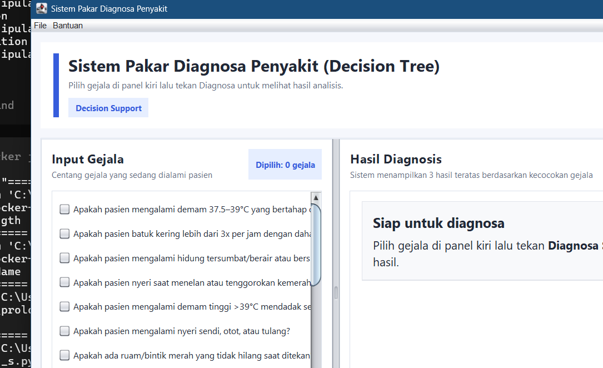

<div align="center">

# Sistem Pakar Penyakit Infeksi

### Aplikasi GUI Java Swing — Diagnosis infeksi & banding non-infeksi (Decision Tree)

[](https://openjdk.org/)
[](https://maven.apache.org/)
[](https://docs.oracle.com/javase/tutorial/uiswing/)
[](LICENSE)

Sistem pakar edukatif mata kuliah **Artificial Intelligence** untuk studi kasus penyakit **infeksi** (Influenza, Demam Berdarah) dengan bandingan penyakit non-infeksi, memakai mesin **Decision Tree**.

</div>

---

## Preview

<div align="center">
  
</div>

## Fitur

- GUI Swing modern: checklist gejala, badge kategori, panel hasil.
- Fokus cabang **Infeksi** (Influenza & Demam Berdarah) pada Decision Tree.
- Diferensiasi otomatis ke cabang **Non-Infeksi** (Diabetes, Hipertensi).
- Menampilkan jalur inferensi dan gejala pendukung.
- Java 21 + Maven, tanpa dependensi eksternal.

## Pohon Keputusan

```text
Diagnosa Penyakit
├── Infeksi
│   ├── Influenza          ← demam, batuk, pilek, tenggorokan
│   └── Demam Berdarah     ← demam tinggi, nyeri sendi, ruam, mual
└── Non-Infeksi
    ├── Diabetes
    └── Hipertensi
```

## Gejala Utama (Infeksi)

| Penyakit | Gejala kunci |
|---|---|
| **Influenza** | Demam 37.5–39°C, batuk, pilek, sakit tenggorokan |
| **Demam Berdarah** | Demam >39°C mendadak, nyeri sendi/otot, ruam, mual |

## Struktur Repository

```text
infectious_diseases_GUI/
├── assets/screenshots/main-gui.png
├── src/main/java/com/mycompany/gastroentero_hepatologi/
│   ├── Gastroentero_Hepatologi.java   # Entry point (main)
│   ├── MainFrame.java
│   ├── SymptomPanel.java
│   ├── ResultPanel.java
│   ├── InferenceEngine.java
│   ├── KnowledgeBase.java
│   └── ... (model: Disease, Symptom, DecisionTreeNode, DiagnosisResult)
├── pom.xml
└── README.md
```

> Catatan: package Java masih `com.mycompany.gastroentero_hepatologi` dari template awal proyek; nama class entry point dipertahankan agar build tetap stabil.

## Cara Menjalankan

Prasyarat: **JDK 21+**, **Maven 3.9+**.

```bash
git clone https://github.com/ausartal/infectious_diseases_GUI.git
cd infectious_diseases_GUI

mvn -q -DskipTests compile
java -cp target/classes com.mycompany.gastroentero_hepatologi.Gastroentero_Hepatologi
```

Atau dengan Exec Maven Plugin:

```bash
mvn -q exec:java
```

## Cara Pakai

1. Centang gejala infeksi yang sesuai (bisa juga gejala banding).
2. Tekan **Diagnosa**.
3. Evaluasi hasil: penyakit terduga + kecocokan gejala.

## Teknis

| Komponen | Peran |
|---|---|
| `KnowledgeBase` | Aturan gejala & struktur pohon |
| `InferenceEngine` | Evaluasi Decision Tree |
| `MainFrame` | Layout 2 panel (gejala | hasil) |

## Disclaimer

Hanya untuk **pembelajaran AI / sistem pakar** — bukan alat diagnosis medis.

## Penulis

**Ahmad Nabah Falah** — [@ausartal](https://github.com/ausartal)
